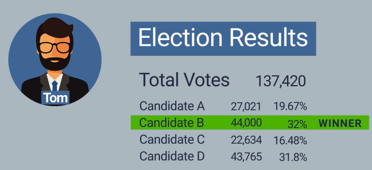
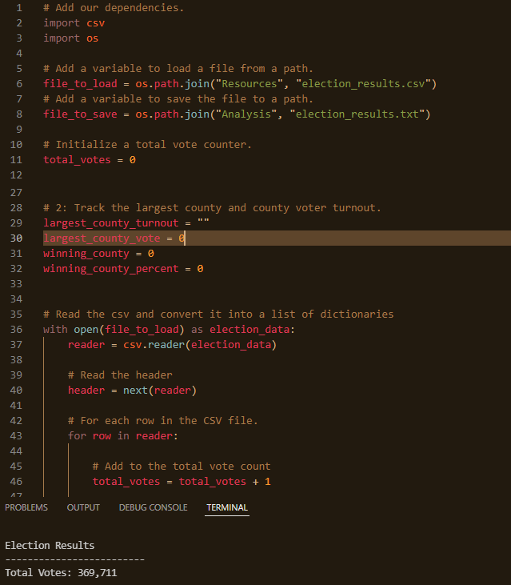
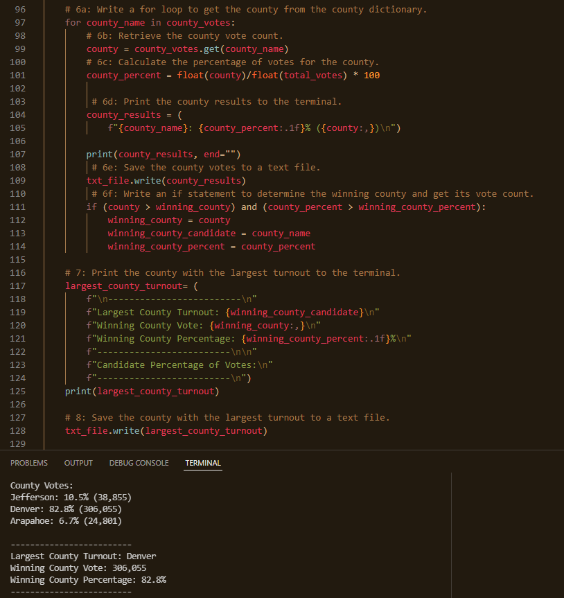
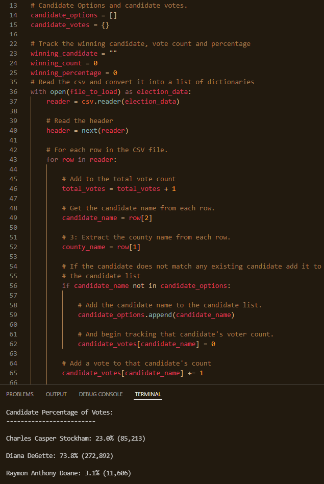
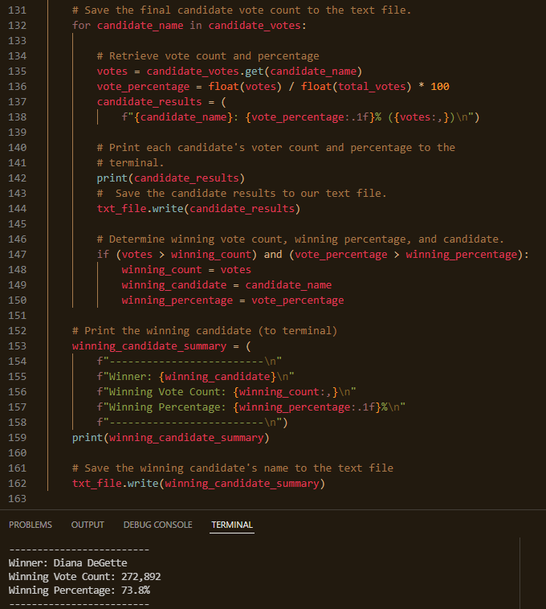
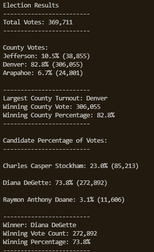

# Election_Analysis

## Project Summary

Tom a Colorado Board of Elections employee has requested help with automating an election audit of a local congressional election using Python.  The code will tabulate votes from three sources: mail in ballots that are hand counted, punch card ballots that are machine counted and last ballots from voting machines stored on memory cards.

## The main goals:
Tabulate the total number of votes.
Tabulate the total number of votes for each candidate.
Calculate the percentage of each candidates votes.
Last declare a winner of the election based on the popular vote.

## Resources for reaching goals:
----Data Source: election_results. csv
----Software: Visual Studio Code, for writing the Python code & the Python code itself 

## Election Summary

After running the election data through the code the analysis shows that:

* There were **369,711 Total Votes**
* Candidates running for office:
  * Charles Casper Stockham
  * Diana DeGette
  * Raymon Anthony Doane
* Individual candidate results:
  * Charles Casper Stockham - had a total of **85,213** votes, taking **23.0%** of the vote.
  * Diana DeGette - had a total of **272,892** votes, taking **73.8%** of the vote.
  * Raymon Anthony Doane - had a total of **11,606** votes, taking **3.1%** of the vote.
* The election winner:
  * **Diana DeGette** coming in with more votes than the combined count of the two opponents, at a total of **272,892** votes, resulting in **73.8%** of the vote.

## Challange Overview

For the challange the election commission has requested some additional data to complete the audit.
  *Voter turnout per county.
  *Percentage of votes per county from out of the total count.
  *County with the highest turnout.
The data set remaind the same but now taking the analysis furher.

## Challange Summary

To start we first needed the total vote count.  The CSV was loaded and analyzed by rows to get the total vote.

Next we wanted to get a breakdown of the votes total count and percentage per county and ultimately turn our attention to what county had teh largest turn out.

We can see Denver was decidedly the county to win having near 83% of the voter turn out.

Next we'll look at the total votes per candidate along with the percentage of votes.

Last for the results we printed the winner along with the winning vote count and percentage.

Diana Degette took the election comfortably, with a 73% winning percentage.

The results in summary:

## Outlook

The biggest advantage to having the code written as it is - the Board of Elections can feed into the code elections from years past or future analysis.  With a slight modification of what CSV file to load, the code can be used going forward.  Also the code could go one step further to look at demographics of voters if the data is captured and formated into the CSV.  This would require much more lines of code similar to county break outs.  In summary the code as is purpose built to meet the requirements needed now to create a high level summary of elections.